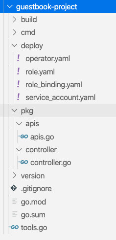
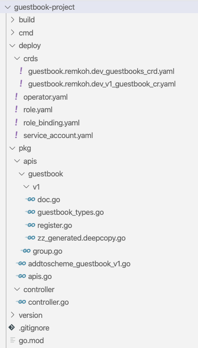

# Create an Operator of Type Go using the Operator SDK

## About Operators

See [https://kubernetes.io/docs/concepts/extend-kubernetes/operator/](https://kubernetes.io/docs/concepts/extend-kubernetes/operator/).

Operators are clients of the Kubernetes API that act as controllers for a Custom Resource. Operators are extensions to Kubernetes that use custom resources to manage applications and their components. They follow the Kubernetes principle of the control loop.

## About the Operator Framework

The Operator Framework is an open source toolkit to manage Operators. The Operator SDK provides the following workflow to develop a new Operator:

The following workflow is for a new Go operator:

1. Create a new operator project using the SDK Command Line Interface(CLI)
2. Define new resource APIs by adding Custom Resource Definitions(CRD)
3. Define Controllers to watch and reconcile resources
4. Write the reconciling logic for your Controller using the SDK and controller-runtime APIs
5. Use the SDK CLI to build and generate the operator deployment manifests

## Install sdk-operator

For detailed installation instructions go [here](https://sdk.operatorframework.io/docs/install-operator-sdk/).

To install the Operator SDK in Ubuntu, you need to install the Go tools and the Operator SDK.

```bash
curl -LO https://golang.org/dl/go1.14.4.linux-amd64.tar.gz
tar -C /usr/local -xzf go1.14.4.linux-amd64.tar.gz
export PATH=$PATH:/usr/local/go/bin

curl -LO https://github.com/operator-framework/operator-sdk/releases/download/v0.18.2/operator-sdk-v0.18.2-x86_64-linux-gnu
chmod +x operator-sdk-v0.18.2-x86_64-linux-gnu
sudo mkdir -p /usr/local/bin/
sudo cp operator-sdk-v0.18.2-x86_64-linux-gnu /usr/local/bin/operator-sdk
rm operator-sdk-v0.18.2-x86_64-linux-gnu

go version
operator-sdk version
```

## 1. Create a New Project

Create a [new Operator](https://docs.openshift.com/container-platform/4.3/operators/operator_sdk/osdk-cli-reference.html#osdk-cli-reference-new_osdk-cli-reference) project,

```bash
export DOCKER_USERNAME=<your-docker-username>

export OPERATOR_NAME=guestbook-operator
export OPERATOR_PROJECT=guestbook-project
export OPERATOR_GROUP=guestbook.remkoh.dev
export OPERATOR_VERSION=v1
export CRD_KIND=Guestbook

go version
operator-sdk version

operator-sdk new $OPERATOR_PROJECT --type go --repo github.com/$DOCKER_USERNAME/$OPERATOR_NAME

cd $OPERATOR_PROJECT
```

The scaffolding of a new project will create an operator, an api and a controller.



## 2. Create a new API

Add a new API definition for a new Custom Resource under `pkg/apis` and generate the Custom Resource Definition (CRD) and Custom Resource (CR) files under `deploy/crds`.

```bash
operator-sdk add api --api-version=$OPERATOR_GROUP/$OPERATOR_VERSION --kind=$CRD_KIND
```

The command will create a new API, a Custom Resource (CR), a Custom Resource Definition (CRD).



One file is created in `pkg/apis` called `addtoscheme_guestbook_v1.go` that registers the new schema. One new file is created in `pkg/apis/guestbook` called `group.go` that defines the package. Four new files are created in `pkg/apis/guestbook/v1`:

- doc.go,
- guestbook_types.go,
- register.go,
- zz_generated.deepcopy.go.

The `guestbook_types.go` file,

```go
package v1

import (
 metav1 "k8s.io/apimachinery/pkg/apis/meta/v1"
)

// GuestbookSpec defines the desired state of Guestbook
type GuestbookSpec struct {
}

// GuestbookStatus defines the observed state of Guestbook
type GuestbookStatus struct {
}

type Guestbook struct {
 metav1.TypeMeta   `json:",inline"`
 metav1.ObjectMeta `json:"metadata,omitempty"`

 Spec   GuestbookSpec   `json:"spec,omitempty"`
 Status GuestbookStatus `json:"status,omitempty"`
}

// GuestbookList contains a list of Guestbook
type GuestbookList struct {
 metav1.TypeMeta `json:",inline"`
 metav1.ListMeta `json:"metadata,omitempty"`
 Items           []Guestbook `json:"items"`
}

func init() {
 SchemeBuilder.Register(&Guestbook{}, &GuestbookList{})
}
```

The Custom Resource (CR) in file `deploy/crds/guestbook.remkoh.dev_v1_guestbook_cr`,

```yaml
apiVersion: guestbook.remkoh.dev/v1
kind: Guestbook
metadata:
  name: example-guestbook
spec:
  # Add fields here
  size: 3
```

The Custom Resource Definition (CRD) in file `deploy/crds/guestbook.remkoh.dev_guestbooks_crd.yaml`,

```yaml
apiVersion: apiextensions.k8s.io/v1
kind: CustomResourceDefinition
metadata:
  name: guestbooks.guestbook.remkoh.dev
spec:
  group: guestbook.remkoh.dev
  names:
    kind: Guestbook
    listKind: GuestbookList
    plural: guestbooks
    singular: guestbook
  scope: Namespaced
  versions:
  - name: v1
    schema:
      openAPIV3Schema:
        description: Guestbook is the Schema for the guestbooks API
        properties:
          apiVersion:
            description: 'APIVersion defines the versioned schema of this representation
              of an object. Servers should convert recognized schemas to the latest
              internal value, and may reject unrecognized values. More info: https://git.k8s.io/community/contributors/devel/sig-architecture/api-conventions.md#resources'
            type: string
          kind:
            description: 'Kind is a string value representing the REST resource this
              object represents. Servers may infer this from the endpoint the client
              submits requests to. Cannot be updated. In CamelCase. More info: https://git.k8s.io/community/contributors/devel/sig-architecture/api-conventions.md#types-kinds'
            type: string
          metadata:
            type: object
          spec:
            description: GuestbookSpec defines the desired state of Guestbook
            type: object
          status:
            description: GuestbookStatus defines the observed state of Guestbook
            type: object
        type: object
    served: true
    storage: true
    subresources:
      status: {}
```

## 3. Create a new Controller

Add a new controller under `pkg/controller/<kind>`.

```bash
operator-sdk add controller --api-version=$OPERATOR_GROUP/$OPERATOR_VERSION --kind=$CRD_KIND
```

This command creates two files in `pkg/controller`:

- `add_guestbook.go`, which registers the new controller, and
- `guestbook/guestbook_controller.go`, which is the actual custom controller logic.

The file `guestbook/guestbook_controller.go` defines the `Reconcile` function,

```go
// Reconcile reads state of the cluster for a Guestbook object and makes changes based on the state read and what is in the Guestbook.Spec
// TODO(user): User must modify this Reconcile function to implement their own Controller logic.  This example creates a Pod as an example
func (r *ReconcileGuestbook) Reconcile(request reconcile.Request) (reconcile.Result, error) {
    ...
    // Fetch the Guestbook instance
 instance := &guestbookv1.Guestbook{}
    ...
    // Define a new Pod object
 pod := newPodForCR(instance)
    ...
}
```

## 4. Compile and Build the Code

The operator-sdk build command compiles the code and builds the executables. fter you built the image, push it to your image registry, e.g. Docker hub.

```bash
operator-sdk build docker.io/$DOCKER_USERNAME/$OPERATOR_NAME
docker login docker.io -u $DOCKER_USERNAME
docker push docker.io/$DOCKER_USERNAME/$OPERATOR_NAME
```

## 5. Deploy the Operator

First replace the image attribute in the operator resource with the built image,

```bash
sed -i "s|REPLACE_IMAGE|docker.io/$DOCKER_USERNAME/$OPERATOR_NAME|g" deploy/operator.yaml
```

Make sure you are connected to the OpenShift cluster (see above how to connect), and deploy the operator with the following template code.

```bash
oc create sa $OPERATOR_PROJECT
oc create -f deploy/role.yaml
oc create -f deploy/role_binding.yaml
oc create -f deploy/crds/${OPERATOR_GROUP}_${CRD_KIND,,}s_crd.yaml
oc create -f deploy/operator.yaml
oc create -f deploy/crds/${OPERATOR_GROUP}_${OPERATOR_VERSION}_${CRD_KIND,,}_cr.yaml
oc get deployment $OPERATOR_PROJECT
oc get pod -l app=example-${CRD_KIND,,}
oc describe ${CRD_KIND,,}s.${OPERATOR_GROUP} example-${CRD_KIND,,}
```

For our example Guestbook project the above templates should resolve as follows,

```bash
oc create sa guestbook-project
oc create -f deploy/role.yaml
oc create -f deploy/role_binding.yaml
oc create -f deploy/crds/guestbook.remkoh.dev_guestbooks_crd.yaml
oc create -f deploy/operator.yaml
oc create -f deploy/crds/guestbook.remkoh.dev_v1_guestbook_cr.yaml
oc get deployment guestbook-project
oc get pod -l app=example-guestbook
oc describe guestbooks.guestbook.remkoh.dev example-guestbook
```

## Cleanup

```bash
oc delete sa $OPERATOR_PROJECT
oc delete role $OPERATOR_PROJECT
oc delete rolebinding $OPERATOR_PROJECT
oc delete customresourcedefinition ${CRD_KIND,,}s.${OPERATOR_GROUP}
oc delete deployment $OPERATOR_PROJECT
```
