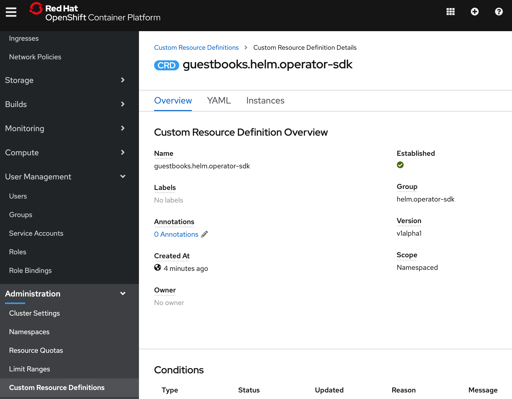
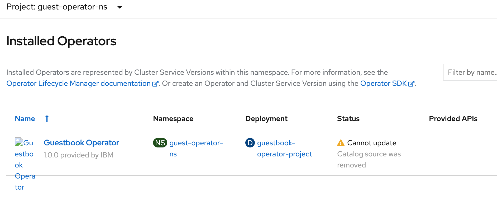
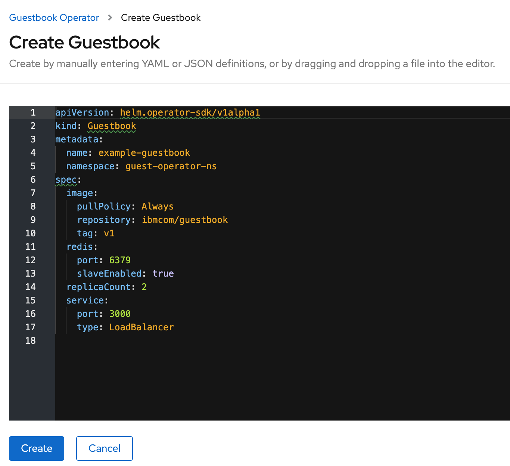

# Create an Operator using an Existing Helm Chart

The Operator Framework is an open source project that provides developer and runtime Kubernetes tools, enabling you to accelerate the development of an Operator. The Operator SDK provides the tools to build, test and package Operators.

The following workflow is for a Helm operator using existing chart :

1. Create a new operator project using the SDK Command Line Interface(CLI)
2. Create a new (or add your existing) Helm chart for use by the operator’s reconciling logic
3. Use the SDK CLI to build and generate the operator deployment manifests
4. Optionally add additional CRD’s using the SDK CLI and repeat steps 2 and 3
5. Use the SDK bundle feature to package the operator for OLM deployment.
6. Deploy, test and publish.

In this lab, we will use the IBM Guestbook helm chart available [here](https://ibm.github.io/helm101) as the base to scaffold a new operator.

Information of creating a new operator can be found [here](https://docs.openshift.com/container-platform/4.3/operators/operator_sdk/osdk-getting-started.html)

## Setup

The lab requires you to have the `operator-sdk` installed. Login into the client CLI following these [instructions](https://ibm-developer.gitbook.io/openshift-bootcamp/v/workshop-openshift101/setup/cognitiveclass). Run the command shown below to install the prerequisites:

```bash
source <(curl -s https://raw.githubusercontent.com/rojanjose/guestbook-helm-operator/master/scripts/operatorInstall.sh)
```

Check the command output to ensure the SDK version is correct.

```bash
...
Checking prereqs version ...
Go version:
go version go1.14.4 linux/amd64
-----------------------------
Helm version:
version.BuildInfo{Version:"v3.0.3", GitCommit:"ac925eb7279f4a6955df663a0128044a8a6b7593", GitTreeState:"clean", GoVersion:"go1.13.6"}
-----------------------------
Operator-sdk version:
operator-sdk version: "v0.19.2", commit: "4282ce9acdef6d7a1e9f90832db4dc5a212ae850", kubernetes version: "v1.18.2", go version: "go1.13.10 linux/amd64"
```

Log into your OpenShift [cluster](https://ibm-developer.gitbook.io/openshift-bootcamp/v/workshop-openshift101/setup/grantcluster).

```bash
oc login --token=YQ2-mTJIWlz1gsWeI2tsO4CzHBbRSCQbH-IdA3tEFrM --server=https://c100-e.us-east.containers.cloud.ibm.com:32055
```

### Create the operator

### 1. Create a new project

Export these environment variables prior to starting the project.

```bash
export DOCKER_USERNAME=<your-docker-username>
export OPERATOR_NAME=guestbook-operator
export OPERATOR_PROJECT=guestbook-operator-project
export OPERATOR_VERSION=v1.0.0

export IMG=docker.io/${DOCKER_USERNAME}/${OPERATOR_NAME}:${OPERATOR_VERSION}
```

Create a new project called guestbook-operator using the existing guestbook helm chart. The guestbook chart is available at the repo `https://ibm.github.io/helm101/`.

```bash
operator-sdk new $OPERATOR_PROJECT --type=helm --helm-chart=guestbook --helm-chart-repo=https://ibm.github.io/helm101/
cd $OPERATOR_PROJECT
```

Output:

```bash
INFO[0000] Creating new Helm operator 'guestbook-operator-project'.
INFO[0000] Created helm-charts/guestbook
INFO[0000] Generating RBAC rules
I0813 23:07:00.995286   11211 request.go:621] Throttling request took 1.031369076s, request: GET:https://c100-e.us-east.containers.cloud.ibm.com:31941/apis/scheduling.k8s.io/v1?timeout=32s
WARN[0002] The RBAC rules generated in deploy/role.yaml are based on the chart's default manifest. Some rules may be missing for resources that are only enabled with custom values, and some existing rules may be overly broad. Double check the rules generated in deploy/role.yaml to ensure they meet the operator's permission requirements.
INFO[0002] Created build/Dockerfile
INFO[0002] Created deploy/service_account.yaml
INFO[0002] Created deploy/role.yaml
INFO[0002] Created deploy/role_binding.yaml
INFO[0002] Created deploy/operator.yaml
INFO[0002] Created deploy/crds/helm.operator-sdk_v1alpha1_guestbook_cr.yaml
INFO[0002] Generated CustomResourceDefinition manifests.
INFO[0002] Project creation complete.
```


Review the code and customize the operator logic as required to obtain the desired results. By default, the Guestbook operator installs the configured helm chart watches the events shown in the `watches.yaml`.

```yaml
- group: helm.operator-sdk
  version: v1alpha1
  kind: Guestbook
  chart: helm-charts/guestbook
```

The custom resource (CR) file defines the properties used by operator while it creates an instance of the Guestbook application. These properties are derived from the `values.yaml` file in the Helm chart.

```yaml
apiVersion: helm.operator-sdk/v1alpha1
kind: Guestbook
metadata:
  name: example-guestbook
spec:
  # Default values copied from <project_dir>/helm-charts/guestbook/values.yaml

  image:
    pullPolicy: Always
    repository: ibmcom/guestbook
    tag: v1
  redis:
    port: 6379
    slaveEnabled: true
  replicaCount: 2
  service:
    port: 3000
    type: LoadBalancer
```

### 2. Deploy the CRD

Let Kubernetes know about the new custom resource definition (CRD) the operator will be watching.

```bash
oc create -f deploy/crds/helm.operator-sdk_guestbooks_crd.yaml
```

Verify the CRD install in OpenShift console:



Alternatively, query using the following CLI commands:

```bash
oc get crd guestbooks.helm.operator-sdk
oc describe crd guestbooks.helm.operator-sdk
```

### 3. Build the code

Use the generated Dockerfile under build directory for image build.

```Dockerfile
FROM quay.io/operator-framework/helm-operator:v0.19.2

COPY watches.yaml ${HOME}/watches.yaml
COPY helm-charts/ ${HOME}/helm-charts/
```

Run the operator sdk build command to build the image for the helm operator.

```bash
operator-sdk build ${IMG}
```

```bash
INFO[0000] Building OCI image docker.io/rojanjose/guestbook-operator:v1.0.0
Sending build context to Docker daemon  41.98kB
Step 1/3 : FROM quay.io/operator-framework/helm-operator:v0.19.2
v0.19.2: Pulling from operator-framework/helm-operator
41ae95b593e0: Pull complete
f20f68829d13: Pull complete
05c2e7d4212e: Pull complete
66213365a0c9: Pull complete
09e5a7e28c6f: Pull complete
Digest: sha256:0f1e104719267f687280d8640a6958c61510fae27a6937369c419b0dd2b91564
....
```

Verify the built image:

```bash
$ docker images
REPOSITORY                                 TAG                 IMAGE ID            CREATED             SIZE
rojanjose/guestbook-operator               v1.0.0              d05f5e2c441e        7 seconds ago       200MB
quay.io/operator-framework/helm-operator   v0.19.2             11862329f28c        2 weeks ago         200MB
```

Log into the docker registry and push image:

```bash
docker login docker.io -u $DOCKER_USERNAME
docker push ${IMG}
```

Replace the image name string in the `operator.yaml` file:

```bash
sed -i 's|REPLACE_IMAGE|'${IMG}'|g' deploy/operator.yaml

(MacOS:)
sed -i "" 's|REPLACE_IMAGE|'${IMG}'|g' deploy/operator.yaml
```

At this stage, the operator can be deployed with the available manifest files, however, we will explore the operator deloy with OLM features.

### 4. Deploy the Operator with the Operator Lifecycle Manager (OLM)

Ensure OLM is enabled on the cluster by running this command:

```bash
operator-sdk olm status --olm-namespace openshift-operator-lifecycle-manager
```

Expected result:

```bash
operator-sdk olm status --olm-namespace openshift-operator-lifecycle-manager
I0813 23:36:41.881438   14844 request.go:621] Throttling request took 1.020925705s, request: GET:https://c100-e.us-east.containers.cloud.ibm.com:31941/apis/rbac.authorization.k8s.io/v1beta1?timeout=32s
INFO[0002] Fetching CRDs for version "0.13.0"
INFO[0002] Fetching resources for version "0.13.0"
INFO[0003] Successfully got OLM status for version "0.13.0"

NAME                                            NAMESPACE    KIND                        STATUS
installplans.operators.coreos.com                            CustomResourceDefinition    Installed
clusterserviceversions.operators.coreos.com                  CustomResourceDefinition    Installed
aggregate-olm-view                                           ClusterRole                 Installed
operatorgroups.operators.coreos.com                          CustomResourceDefinition    Installed
catalogsources.operators.coreos.com                          CustomResourceDefinition    Installed
subscriptions.operators.coreos.com                           CustomResourceDefinition    Installed
system:controller:operator-lifecycle-manager                 ClusterRole                 Installed
aggregate-olm-edit                                           ClusterRole                 Installed
olm-operator-binding-olm                                     ClusterRoleBinding          clusterrolebindings.rbac.authorization.k8s.io "olm-operator-binding-olm" not found
olm-operator-serviceaccount                     olm          ServiceAccount              serviceaccounts "olm-operator-serviceaccount" not found
olm-operator                                    olm          Deployment                  deployments.apps "olm-operator" not found
catalog-operator                                olm          Deployment                  deployments.apps "catalog-operator" not found
operators                                                    Namespace                   namespaces "operators" not found
olm                                                          Namespace                   namespaces "olm" not found
global-operators                                operators    OperatorGroup               operatorgroups.operators.coreos.com "global-operators" not found
olm-operators                                   olm          OperatorGroup               operatorgroups.operators.coreos.com "olm-operators" not found
packageserver                                   olm          ClusterServiceVersion       clusterserviceversions.operators.coreos.com "packageserver" not found
operatorhubio-catalog                           olm          CatalogSource               catalogsources.operators.coreos.com "operatorhubio-catalog" not found
```

[Note: OLM is partially enabled which is sufficient to complete this lab.]

Create a bundle:

```bash
operator-sdk generate bundle --version 1.0.0
```

Output of the command:

```bash
INFO[0000] Generating bundle manifests version 1.0.0

Display name for the operator (required):
> Guestbook Operator

Description for the operator (required):
> Demo helm operator for Guestbook

Provider's name for the operator (required):
> IBM

Any relevant URL for the provider name (optional):
> https://github.com/rojanjose/guestbook-helm-operator

Comma-separated list of keywords for your operator (required):
> helm,operator,kubernetes,openshift

Comma-separated list of maintainers and their emails (e.g. 'name1:email1, name2:email2') (required):
> Rojan:rojanjose@gmail.com
INFO[0164] Bundle manifests generated successfully in deploy/olm-catalog/guestbook-operator-project
INFO[0164] Building annotations.yaml
INFO[0164] Writing annotations.yaml in /Users/operator/guestbook-operator-project/deploy/olm-catalog/guestbook-operator-project/metadata
INFO[0164] Building Dockerfile
INFO[0164] Writing bundle.Dockerfile in /Users/operator/guestbook-operator-project
```

A bundle manifests directory deploy/olm-catalog/guestbook-operator-project/manifests containing a CSV and all CRDs in deploy/crds and a bundle metadata directory deploy/olm-catalog/guestbook-operator-project/metadata are generated.


Create Project where operator OLM should be installed:

```bash
oc new-project guest-operator-ns
```

Output:

```bash
Now using project "guest-operator-ns" on server "https://c100-e.us-east.containers.cloud.ibm.com:31941".

You can add applications to this project with the 'new-app' command. For example, try:

    oc new-app django-psql-example
...
```

Create an OperatorGroup yaml definition:

```bash
cat <<EOF >>deploy/operator_group.yaml
apiVersion: operators.coreos.com/v1
kind: OperatorGroup
metadata:
  name: guestbook-og
  namespace: guest-operator-ns
spec:
  targetNamespaces:
  - guest-operator-ns
EOF
```

Replace `placeholder` string with project `guest-operator-ns` in
`guestbook-operator.clusterserviceversion.yaml`

```bash
sed -i 's#namespace: placeholder#namespace: guest-operator-ns#' deploy/olm-catalog/guestbook-operator-project/manifests/guestbook-operator-project.clusterserviceversion.yaml
```

or on Mac,

```bash
sed -i "" 's#namespace: placeholder#namespace: guest-operator-ns#' deploy/olm-catalog/guestbook-operator-project/manifests/guestbook-operator-project.clusterserviceversion.yaml
```

### 5. Install the operator

Create the Operator group:

```bash
oc create -f deploy/operator_group.yaml
```

Apply the Operator’s CSV manifest to the specified namespace in the cluster:

```bash
oc create -f deploy/olm-catalog/guestbook-operator-project/manifests/guestbook-operator-project.clusterserviceversion.yaml
```

Create the role, role binding, and service account to grant resource permissions to the Operator to create the Guestbook type that the Operator manages:

```bash
oc create -f deploy/service_account.yaml
oc create -f deploy/role.yaml
oc create -f deploy/role_binding.yaml
```

Wait for few minutes for the Guestbook operator to complete the installation.

```bash
oc get ClusterServiceVersion
```

ClusterServiceVersion should show a PHASE value of `Succeeded`,

```bash
$ oc get ClusterServiceVersion
NAME                                DISPLAY              VERSION   REPLACES   PHASE
guestbook-operator-project.v1.0.0   Guestbook Operator   1.0.0                Succeeded
```

Check the list of `Installed Operators` under the project `guest-operator-ns`.



Open the operator and validate that install succeeded.


Now, create an instance of Guestbook helm chart. Click on `Create instance` icon.



Goto `Workloads > Pods` to view the pods. You should see 2 frontend pods, 1 Redis master, 2 Redis slave and pod supporting the Guestbook operator OLM.


### 6. Update the Guestbook application instance

Open the `deploy/crds/helm.operator-sdk_v1alpha1_guestbook_cr.yaml` and change the value of `replicaCount` to 4.


Save the file and run the `oc apply` command:

```bash
oc apply -f deploy/crds/helm.operator-sdk_v1alpha1_guestbook_cr.yaml
```

Run `oc get pods` to validate the guesbook pod count:

```bash
oc get podsNAME                                          READY   STATUS    RESTARTS   AGE
example-guestbook-6fdb6776b-hdq64             1/1     Running   0          41m
example-guestbook-6fdb6776b-pktr8             1/1     Running   0          8s
example-guestbook-6fdb6776b-x2nqw             1/1     Running   0          41m
example-guestbook-6fdb6776b-xz8lp             1/1     Running   0          77s
guestbook-operator-project-767cc5686c-ksmxq   1/1     Running   0          52m
redis-master-68857cd57c-pwctp                 1/1     Running   0          41m
redis-slave-bbd8d8545-6jk8m                   1/1     Running   0          41m
redis-slave-bbd8d8545-k65wz                   1/1     Running   0          41m
```

### 7. Clean up

Run the `oc delete` commands to remove the operator.

```bash
oc delete -f deploy/crds/helm.operator-sdk_v1alpha1_guestbook_cr.yaml

oc delete -f deploy/service_account.yaml
oc delete -f deploy/role.yaml
oc delete -f deploy/role_binding.yaml

oc delete -f deploy/olm-catalog/guestbook-operator-project/manifests/guestbook-operator-project.clusterserviceversion.yaml
oc delete -f deploy/operator_group.yaml

oc delete -f deploy/crds/helm.operator-sdk_guestbooks_crd.yaml
```
