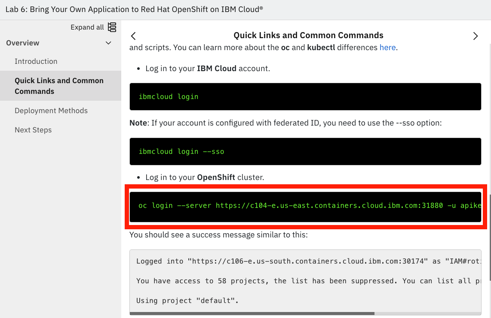
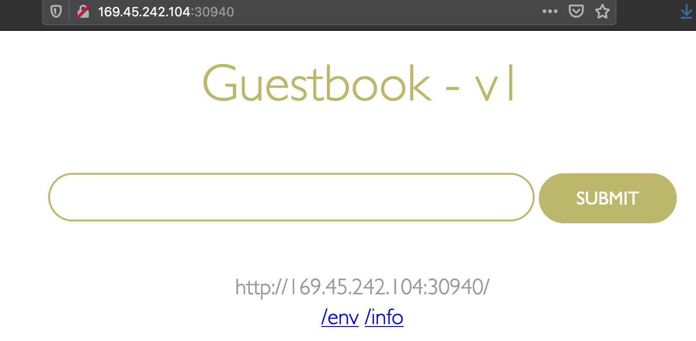
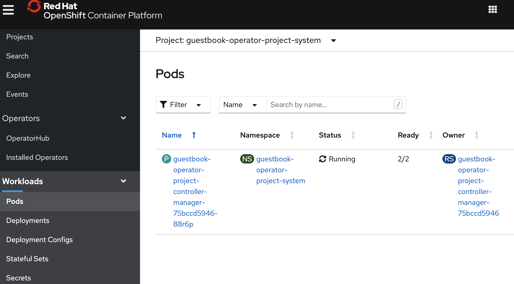
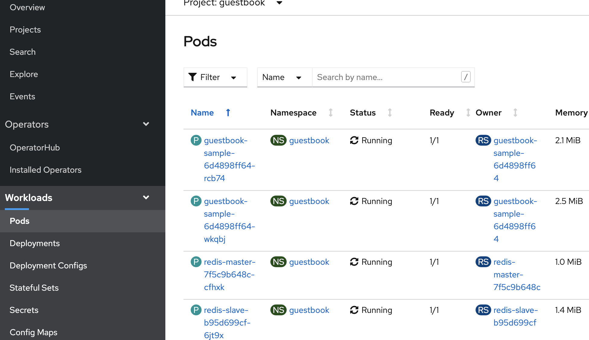

# Create an Operator using an Existing Helm Chart

The [Operator Framework](https://operatorframework.io/) is an open source project that provides developer and runtime Kubernetes tools, enabling you to accelerate the development of an Operator. The Operator SDK provides the tools to build, test and package Operators.

The following workflow is to build an operator using an existing Helm chart :

1. Create a new operator project and initialize it using the SDK Command Line Interface(CLI)
2. Create the API to generate the CRD files for the chart. 
3. Build the Operator container image and push it to a registry.
4. Apply the CRD in the cluster and deploy the operator image.
5. Deploy the operand by applying the custom resource (CR) into the cluster.
6. Cleanup the deployment.

In this lab, we will use the IBM Guestbook helm chart available [here](https://ibm.github.io/helm101) as the base to scaffold a new operator. 

Information on creating a new operator can be found [here](https://docs.openshift.com/container-platform/4.6/operators/operator_sdk/osdk-getting-started.html)
Operator SDK made several technology and architecture changes with the release of v1.0 which as listed [here](https://www.openshift.com/blog/operator-sdk-reaches-v1.0). 

## Setup

The following must be done before you can get started on the lab:

1. Create your lab environment by following the steps found [here](https://ibm.github.io/workshop-setup/OPENLABS/){:target="_blank"}
    
2. The lab requires a newer version of the `operator-sdk` installed. In the lab terminal, run the commands shown below to install the prerequisites:

    ```bash
    source <(curl -s https://raw.githubusercontent.com/ibm/kubernetes-operators/master/src/scripts/operatorInstall.sh)
    export PATH="${HOME}/bin:${PATH}"
    ```
    ```log
    $ source <(curl -s https://raw.githubusercontent.com/ibm/kubernetes-operators/master/src/scripts/operatorInstall.sh)

    Downloading operaror-sdk-v1.3.0-linux_amd64 ...

      % Total    % Received % Xferd  Average Speed   Time    Time     Time  Current
                                    Dload  Upload   Total   Spent    Left  Speed
    100   632  100   632    0     0   1876      0 --:--:-- --:--:-- --:--:--  1875
    100 64.8M  100 64.8M    0     0  61.9M      0  0:00:01  0:00:01 --:--:-- 61.9M

    operaror-sdk-v1.3.0-linux_amd64 downloaded.
    ......
    ```
    Run a version check after the `operator-sdk` installation is complete:
    ```
    operator-sdk version
    ```
    ```
    $ operator-sdk version
    operator-sdk version: "v1.3.0", commit: "1abf57985b43bf6a59dcd18147b3c574fa57d3f6", kubernetes version: "1.19.4", go version: "go1.15.5", GOOS: "linux", GOARCH: "amd64"
    ```


3. Log into the OpenShift cluster: Scroll down on the Quick Links and Common commands page until you see a terminal command block with green text and a description above it that says Log in to your OpenShift cluster. Click on the command and it will automatically paste into your terminal and execute.

    

4. This lab uses docker registry to container image storage. Create a new [docker hub](https://hub.docker.com/) id, if you do not have one.

## Create the operator

### 1. Create a new project & initialize it using SDK

Certain parameters will be used repetitively. Export these parameters as environment variables prior to starting the project.

Replace `<your-docker-username>` with your docker hub id.
```bash
export DOCKER_USERNAME=<your-docker-username>
```
Set names for the operator, project and operator version. The operator container images is built using these values.
```bash
export OPERATOR_NAME=guestbook-operator
export OPERATOR_PROJECT=guestbook-operator-project
export OPERATOR_VERSION=v1.0.0
export IMAGE=docker.io/${DOCKER_USERNAME}/${OPERATOR_NAME}:${OPERATOR_VERSION}
```
Create the project directory for the operator.
```bash
mkdir -p ${OPERATOR_PROJECT}
cd ${OPERATOR_PROJECT}
```

Use the operator SDK to initialize the project. Specify the plugin and API group as the parameters for this command.

```bash
operator-sdk init --plugins=helm --domain guestbook.ibm.com

```
```
$ operator-sdk init --plugins=helm --domain guestbook.ibm.com
Next: define a resource with:

$ operator-sdk create api
```

The initialization step create a scaffolding with the operator boiler plate code. At high level, this creates the `config` directory, `watches.yaml` and the place holder for the helm chart.
Use the command `tree .` to view the complete directory structure as shown in the block below:
```
.
├── Dockerfile
├── Makefile
├── PROJECT
├── config
│   ├── default
│   │   ├── kustomization.yaml
│   │   └── manager_auth_proxy_patch.yaml
│   ├── manager
│   │   ├── kustomization.yaml
│   │   └── manager.yaml
│   ├── prometheus
│   │   ├── kustomization.yaml
│   │   └── monitor.yaml
│   ├── rbac
│   │   ├── auth_proxy_client_clusterrole.yaml
│   │   ├── auth_proxy_role.yaml
│   │   ├── auth_proxy_role_binding.yaml
│   │   ├── auth_proxy_service.yaml
│   │   ├── kustomization.yaml
│   │   ├── leader_election_role.yaml
│   │   ├── leader_election_role_binding.yaml
│   │   ├── role.yaml
│   │   └── role_binding.yaml
│   └── scorecard
│       ├── bases
│       │   └── config.yaml
│       ├── kustomization.yaml
│       └── patches
│           ├── basic.config.yaml
│           └── olm.config.yaml
├── helm-charts
└── watches.yaml
```
Operator SDK uses the kubernetes [Kustomize](https://github.com/kubernetes-sigs/kustomize) tool for managing the deployment of yaml files, hence you see the `kustomization.yaml` in all the directories. `config/default` and `confg/manager` contains the specification to inject the controller manager container into the operator pod as a side car. The `confg/rbac` folder contains a set of default access control rules. Review the `Makefile` to understand the `operator-sdk`, `kustomize` and `docker` commands executed for various tasks.

### 2. Create the API to generate the CRD files for the chart. 

Next step, create the API artifacts. Provide the name and the location of the helm chart as input parameters to this command. This command will create the `crd` folder with the custom resource definition for the Guestbook operator. The command picks the latest version of the helm chart, if the helm version parameter is ignored.
```
operator-sdk create api --helm-chart=guestbook --helm-chart-repo=https://raw.githubusercontent.com/IBM/helm101/master/ 
```
```
operator-sdk create api --helm-chart=guestbook --helm-chart-repo=https://raw.githubusercontent.com/IBM/helm101/master/
Created helm-charts/guestbook
Generating RBAC rules
I0202 15:46:05.545032   48799 request.go:645] Throttling request took 1.005544854s, request: GET:https://c107-e.us-south.containers.cloud.ibm.com:30606/apis/extensions/v1beta1?timeout=32s
WARN[0003] The RBAC rules generated in config/rbac/role.yaml are based on the chart's default manifest. Some rules may be missing for resources that are only enabled with custom values, and some existing rules may be overly broad. Double check the rules generated in config/rbac/role.yaml to ensure they meet the operator's permission requirements.
```

Check the new additions to the scaffolding using the `tree .` command:
```
.
├── Dockerfile
├── Makefile
├── PROJECT
├── config
│   ├── crd
│   │   ├── bases
│   │   │   └── charts.guestbook.ibm.com_guestbooks.yaml
│   │   └── kustomization.yaml
│   ├── default
│   │   ├── kustomization.yaml
│   │   └── manager_auth_proxy_patch.yaml
│   ├── manager
│   │   ├── kustomization.yaml
│   │   └── manager.yaml
│   ├── prometheus
│   │   ├── kustomization.yaml
│   │   └── monitor.yaml
│   ├── rbac
│   │   ├── auth_proxy_client_clusterrole.yaml
│   │   ├── auth_proxy_role.yaml
│   │   ├── auth_proxy_role_binding.yaml
│   │   ├── auth_proxy_service.yaml
│   │   ├── guestbook_editor_role.yaml
│   │   ├── guestbook_viewer_role.yaml
│   │   ├── kustomization.yaml
│   │   ├── leader_election_role.yaml
│   │   ├── leader_election_role_binding.yaml
│   │   ├── role.yaml
│   │   └── role_binding.yaml
│   ├── samples
│   │   └── charts_v1alpha1_guestbook.yaml
│   └── scorecard
│       ├── bases
│       │   └── config.yaml
│       ├── kustomization.yaml
│       └── patches
│           ├── basic.config.yaml
│           └── olm.config.yaml
├── helm-charts
│   └── guestbook
│       ├── Chart.yaml
│       ├── LICENSE
│       ├── README.md
│       ├── templates
│       │   ├── NOTES.txt
│       │   ├── _helpers.tpl
│       │   ├── guestbook-deployment.yaml
│       │   ├── guestbook-service.yaml
│       │   ├── redis-master-deployment.yaml
│       │   ├── redis-master-service.yaml
│       │   ├── redis-slave-deployment.yaml
│       │   └── redis-slave-service.yaml
│       └── values.yaml
└── watches.yaml
```

View the contents of the CRD. Note the values for `names` and `schema.openAPIV3Schema.properties`.
```
more config/crd/bases/charts.guestbook.ibm.com_guestbooks.yaml
```
```
apiVersion: apiextensions.k8s.io/v1
kind: CustomResourceDefinition
metadata:
  name: guestbooks.charts.guestbook.ibm.com
spec:
  group: charts.guestbook.ibm.com
  names:
    kind: Guestbook
    listKind: GuestbookList
    plural: guestbooks
    singular: guestbook
  scope: Namespaced
  versions:
  - name: v1alpha1
    schema:
      openAPIV3Schema:
 ...     
```

### 3. Build the Operator container image and push it to registry.

Login into the docker registry using your personal id and password.
```bash
docker login docker.io -u $DOCKER_USERNAME
```
```
$ docker login docker.io -u $DOCKER_USERNAME
Password: 
WARNING! Your password will be stored unencrypted in /home/student/.docker/config.json.
Configure a credential helper to remove this warning. See
https://docs.docker.com/engine/reference/commandline/login/#credentials-store

Login Succeeded
```

Build the Guestbook operator container image and push image to the docker hub registry. 
```bash
make docker-build docker-push IMG=${IMAGE}
```
```
make docker-build docker-push IMG=${IMAGE}
docker build . -t docker.io/rojanjose/guestbook-operator:v1.0.0
[+] Building 4.2s (9/9) FINISHED
 => [internal] load .dockerignore                                                                                                                                               0.0s
 => => transferring context: 2B                                                                                                                                                 0.0s
 => [internal] load build definition from Dockerfile                                                                                                                            0.0s
 => => transferring dockerfile: 237B
...........
...........

753e76240780: Pushed
4a3bef90e857: Pushed
d0e9a59c2057: Pushed
1d8db7e222a6: Pushed
00af10937683: Pushed
3aa55ff7bca1: Pushed
v1.0.0: digest: sha256:c0724c7f31a748094621b7623a81fae107511c23819b729f25878f7e5a7377dd size: 1984
```

You can view the local docker images by running:
```bash
docker images
```
```
$ docker images
REPOSITORY                                 TAG                 IMAGE ID            CREATED             SIZE
rojanjose/guestbook-operator               v1.0.0              590c0196c2b6        10 seconds ago      160MB
quay.io/operator-framework/helm-operator   v1.3.0              57683a970d10        6 weeks ago         160MB
```

### 4. Apply the CRD in the cluster and deploy the operator image.

Install the Guestbook customer resource definition using the `make install` command:
```
make install
```
```
make install
/home/student/guestbook-operator-project/bin/kustomize build config/crd | kubectl apply -f -
customresourcedefinition.apiextensions.k8s.io/guestbooks.charts.guestbook.ibm.com created
```
View the deployed CRD
```
oc describe  CustomResourceDefinition guestbooks.charts.guestbook.ibm.com
```

Next step is to deploy the operator. Note that the operator is installed in its own namespace `guestbook-operator-project-system`.
```
make deploy IMG=${IMAGE}
```
```
$ make deploy IMG=${IMAGE}
cd config/manager && /home/student/guestbook-operator-project/bin/kustomize edit set image controller=docker.io/rojanjose/guestbook-operator:v1.0.0
/home/student/guestbook-operator-project/bin/kustomize build config/default | kubectl apply -f -
namespace/guestbook-operator-project-system created
customresourcedefinition.apiextensions.k8s.io/guestbooks.charts.guestbook.ibm.com unchanged
role.rbac.authorization.k8s.io/guestbook-operator-project-leader-election-role created
clusterrole.rbac.authorization.k8s.io/guestbook-operator-project-manager-role created
clusterrole.rbac.authorization.k8s.io/guestbook-operator-project-metrics-reader created
clusterrole.rbac.authorization.k8s.io/guestbook-operator-project-proxy-role created
rolebinding.rbac.authorization.k8s.io/guestbook-operator-project-leader-election-rolebinding created
clusterrolebinding.rbac.authorization.k8s.io/guestbook-operator-project-manager-rolebinding created
clusterrolebinding.rbac.authorization.k8s.io/guestbook-operator-project-proxy-rolebinding created
service/guestbook-operator-project-controller-manager-metrics-service created
deployment.apps/guestbook-operator-project-controller-manager created
```

View of what got deployed:
```bash
oc get all -n ${OPERATOR_PROJECT}-system
```
```
$ oc get all -n ${OPERATOR_PROJECT}-system
NAME                                                                 READY   STATUS    RESTARTS   AGE
pod/guestbook-operator-project-controller-manager-7bc6f986dd-2r898   2/2     Running   0          2m24s

NAME                                                                    TYPE        CLUSTER-IP      EXTERNAL-IP   PORT(S)    AGE
service/guestbook-operator-project-controller-manager-metrics-service   ClusterIP   172.21.110.64   <none>        8443/TCP   2m24s

NAME                                                            READY   UP-TO-DATE   AVAILABLE   AGE
deployment.apps/guestbook-operator-project-controller-manager   1/1     1            1           2m24s

NAME                                                                       DESIRED   CURRENT   READY   AGE
replicaset.apps/guestbook-operator-project-controller-manager-7bc6f986dd   1         1         1       2m24s
```


### 5. Deploy the operand by applying the custom resource (CR) into the cluster.

Create a new project called `guestbook` where Guestbook application will be deployed.
```bash
oc new-project guestbook
```
```
$ oc new-project guestbook
Now using project "guestbook" on server "https://c107-e.us-south.containers.cloud.ibm.com:30606".

You can add applications to this project with the 'new-app' command. For example, try:

    oc new-app ruby~https://github.com/sclorg/ruby-ex.git

to build a new example application in Ruby. Or use kubectl to deploy a simple Kubernetes application:

    kubectl create deployment hello-node --image=gcr.io/hello-minikube-zero-install/hello-node
```

An example custom resource yaml file was automatically generated under the `config/samples` directory as part of the `create API` step earlier. This is based on the default `values.yaml` from the Guestbook helm chart under `helm-charts/guestbook/values.yaml`. Let's use this file to create the operand.
```bash
oc apply -f config/samples/charts_v1alpha1_guestbook.yaml
```
```
$ oc apply -f config/samples/charts_v1alpha1_guestbook.yaml
guestbook.charts.guestbook.ibm.com/guestbook-sample created
```
Outcome of the operand deploy can be viewed by running the command:
```bash
oc get all -n guestbook
```
```
$ oc get all -n guestbook
NAME                                    READY   STATUS    RESTARTS   AGE
pod/guestbook-sample-8594c8dc46-bl7sm   1/1     Running   0          75s
pod/guestbook-sample-8594c8dc46-qwgkv   1/1     Running   0          75s
pod/redis-master-68857cd57c-bjxt5       1/1     Running   0          75s
pod/redis-slave-bbd8d8545-57944         1/1     Running   0          75s
pod/redis-slave-bbd8d8545-rxqc5         1/1     Running   0          75s

NAME                       TYPE           CLUSTER-IP       EXTERNAL-IP     PORT(S)          AGE
service/guestbook-sample   LoadBalancer   172.21.41.67     169.45.217.90   3000:30940/TCP   75s
service/redis-master       ClusterIP      172.21.206.242   <none>          6379/TCP         75s
service/redis-slave        ClusterIP      172.21.133.74    <none>          6379/TCP         75s

NAME                               READY   UP-TO-DATE   AVAILABLE   AGE
deployment.apps/guestbook-sample   2/2     2            2           75s
deployment.apps/redis-master       1/1     1            1           75s
deployment.apps/redis-slave        2/2     2            2           75s

NAME                                          DESIRED   CURRENT   READY   AGE
replicaset.apps/guestbook-sample-8594c8dc46   2         2         2       75s
replicaset.apps/redis-master-68857cd57c       1         1         1       75s
replicaset.apps/redis-slave-bbd8d8545         2         2         2       75s
```

Validate the Guestbook application is running by accessing it with the following commands:
```bash
HOSTNAME=`oc get nodes -ojsonpath='{.items[0].metadata.labels.ibm-cloud\.kubernetes\.io\/external-ip}'`
SERVICEPORT=`oc get svc guestbook-sample -o=jsonpath='{.spec.ports[0].nodePort}'`
echo "http://$HOSTNAME:$SERVICEPORT"
```
```
http://169.45.242.104:30940
```

Copy and paste the above URL in a new browser tab to get to the Guestbook landing page as shown below:



Open the OpenShift console to view the artificats created as part of this exerice.

Guestbook operator pod:


Guestbook application pods:


### 6. Cleanup the deployment.

Remove the Guestbook application by deleting the customer resource (CR).

```bash
oc delete -f config/samples/charts_v1alpha1_guestbook.yaml 
```
```
$ oc delete -f config/samples/charts_v1alpha1_guestbook.yaml 
guestbook.charts.guestbook.ibm.com "guestbook-sample" deleted

$ oc get all -n guestbook
No resources found in guestbook namespace.

$ oc delete project guestbook
project.project.openshift.io "guestbook" deleted
```

Finally, to delete the CRDs, run the `make undeploy` command:
```
make undeploy
```
```
$ make undeploy
/home/student/guestbook-operator-project/bin/kustomize build config/default | kubectl delete -f -
namespace "gb-helm-operator-system" deleted
customresourcedefinition.apiextensions.k8s.io "guestbooks.charts.guestbook.ibm.com" deleted
role.rbac.authorization.k8s.io "gb-helm-operator-leader-election-role" deleted
clusterrole.rbac.authorization.k8s.io "gb-helm-operator-manager-role" deleted
clusterrole.rbac.authorization.k8s.io "gb-helm-operator-metrics-reader" deleted
clusterrole.rbac.authorization.k8s.io "gb-helm-operator-proxy-role" deleted
rolebinding.rbac.authorization.k8s.io "gb-helm-operator-leader-election-rolebinding" deleted
clusterrolebinding.rbac.authorization.k8s.io "gb-helm-operator-manager-rolebinding" deleted
clusterrolebinding.rbac.authorization.k8s.io "gb-helm-operator-proxy-rolebinding" deleted
service "gb-helm-operator-controller-manager-metrics-service" deleted
deployment.apps "gb-helm-operator-controller-manager" deleted
```

This concludes the Helm Operator lab. Go [here](https://v1-3-x.sdk.operatorframework.io/docs/building-operators/helm/quickstart/) for additional information on building operators using Helm.
