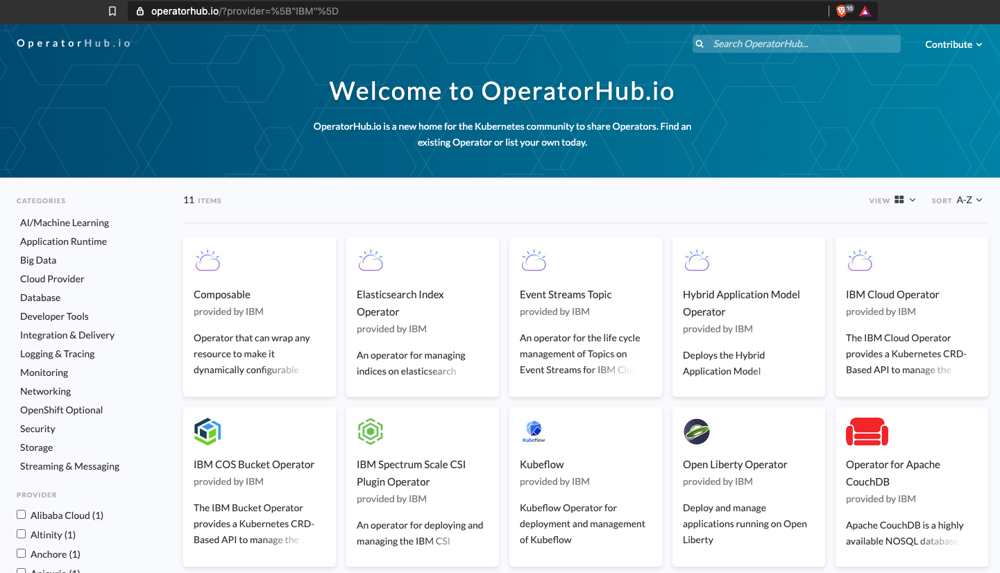

# Operator Tools

To write applications that use the Kubernetes REST API, you can use one of the following supported client libraries:

- [Go](https://github.com/kubernetes/client-go/),
- [Python](https://github.com/kubernetes-client/python/),
- [Java](https://github.com/kubernetes-client/java),
- [CSharp dotnet](https://github.com/kubernetes-client/csharp),
- [JavaScript](https://github.com/kubernetes-client/javascript),
- [Haskell](https://github.com/kubernetes-client/haskell).

In addition, there are many community-maintained [client libraries](https://kubernetes.io/docs/reference/using-api/client-libraries/).

At the [OperatorHub.io](https://operatorhub.io/), you find ready to use operators written by the community.

To write your own operator you can use existing tools:

- [KUDO](https://kudo.dev/) (Kubernetes Universal Declarative Operator),
- [kubebuilder](https://book.kubebuilder.io/),
- [Metacontroller](https://metacontroller.app/) using custom WebHooks,
- the [Operator Framework](https://github.com/operator-framework/getting-started).
