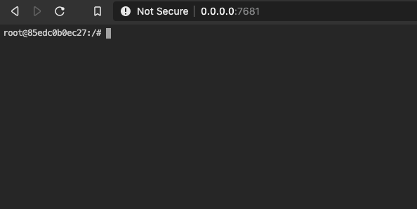

# Client Setup

## Access the web-terminal

When running the lab for Kubernetes Extensions, you can make use of a web-terminal. The Dockerfile to use is located in <https://github.com/IBMAppModernization/web-terminal>, and named [Dockerfile-s2i-oc-tekton-operator](https://github.com/IBMAppModernization/web-terminal/blob/master/Dockerfile-s2i-oc-tekton-operator).

To run on localhost as a Docker container,

```bash
git clone https://github.com/IBMAppModernization/web-terminal.git
cd web-terminal
docker build --no-cache -t web-terminal:latest -f Dockerfile-s2i-oc-tekton-operator .
docker run -d --restart always --name terminal -p 7681:7681 -v $HOME/dev/tmp:/root/dev web-terminal
docker ps -a
CONTAINER ID    IMAGE    COMMAND    CREATED    STATUS    PORTS    NAMES
85edc0b0ec27    web-terminal    "ttyd -p 7681 bash"    17 minutes ago    Up 17 minutes    0.0.0.0:7681->7681/tcp   terminal
```

The volume mapping will write all files under the working directory to the host directory `$HOME/dev/tmp`. So suppose my host's user home directory is `/Users/remkohdev@us.ibm.com/`. If I open the terminal in the browser, the working directory for the user is `/root`. Any file that is created under `/root` is created on the host's directory `$HOME/dev/tmp`. Similarly if I create a file in `$HOME/dev/tmp` it is available in the container's `/root` directory.

Open the web-terminal in a browser and go to <http://0.0.0.0:7681>.



If Go, Operator SD

```bash
export CLUSTERNAME=remkohdev-roks-labs-3n-cluster
ibmcloud login
```

Go to the OpenShift web console
Copy Login command

```bash
oc login --token=_12AbcD345kIPDIRg2jYpCuZ-g5SM5Im9irY2tol4Q8 --server=https://c100-e.us-south.containers.cloud.ibm.com:30712
```
